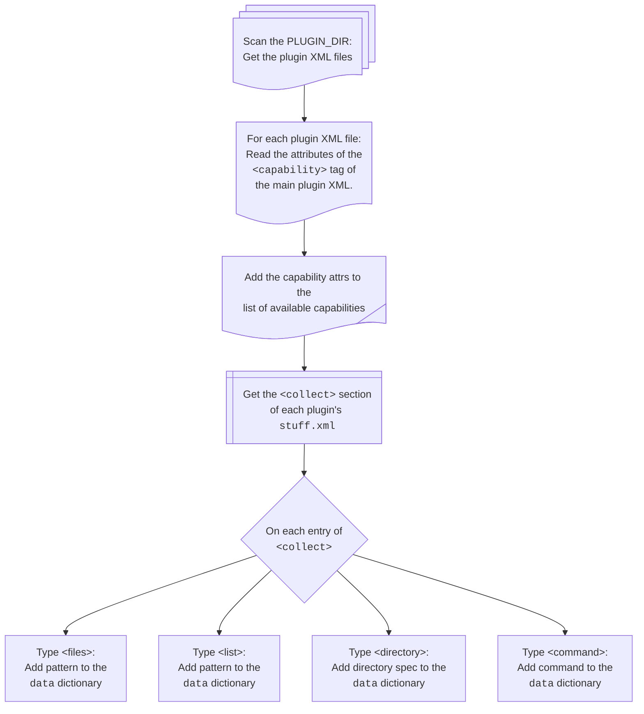
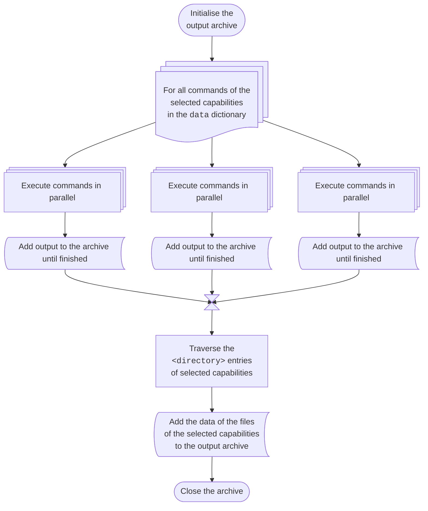

# Operation of `xenserver-status-report`

## High-Level Workflow Phases

1. **Discovery**:

   In the discovery phase, `xenserver-status-report` populates:

   1. The global `caps` dictionary with the supported capabilities
   2. The global `data` dictionary with the supported collection directives.

      For each collection directive, depending on the directive type,
      the `xenserver-status-report` function `load_plugins()` calls these
      internal functions to define directives for collecting the requested data
      for the capability provided by the plugin in the global `data` dictionary
      of `xenserver-status-report`:

      - `file_output()` to define a directive to collect a file for a capability
      - `tree_output()` to define a directive to collect a tree for a capability
      - `func_output()` to define a directive to run an internal function
      - `cmd_output()` to define a directive to run an external command or a script

      The keys are the filenames of the collected data, and the values are
      dictionaries with the following keys:
      - `cap`: The capability of the directive: one of the `CAP_` constants
      - `path`: If created by `file_output`: The path to the file to collect
      - `func`: If created by `func_output`: A function that returns the file data
      - `cmd_args`: If created by `cmd_output`: The command to return the file data
      - `filter`: An optional filter function to pass the file data through

    The function `load_plugins()` also calls these functions to define the
     capabilities and collection directives of the external bugtool plugins.

2. **Selection**:
   Plugins are enabled/disabled based on the `checked` and `hidden` attributes
   and command line flags as well as `XEN_RT` environment variable.

3. **Collection**:
   The actions described in the `<collect>` section are performed.
4. **Archiving**:
   Collected data is archived in a `tar` or `zip` archive for submission.

## Discovery Phase

During the discovery phase, functions in `xenserver-status-report()`
collect metadata about the data collection capabilities of xen-bugtool
and its plugins.

For the plugins, this discovery is done by `load_plugins()`:

## Selection phase

In the selection phase, some or all discovered capabilities are selected
for collection.

## Collection Phase

In the collection phase, `xenserver-status-report` traverses the internal `data`
dictionary populated during the discovery phase for selected entries.

It is implemented in the `collect_data()` function and the function it calls.

The sub-phases are:

1. Initialise the output archive.
2. Run the commands of the selected capabilities and archive their output.
   - Note: Some commands may create or update files to collect in the next steps
3. Traverse the `<directory>` entries of the selected capabilities for files.
4. Archive the files of the selected capabilities.

### Flowchart of the Collection phase

