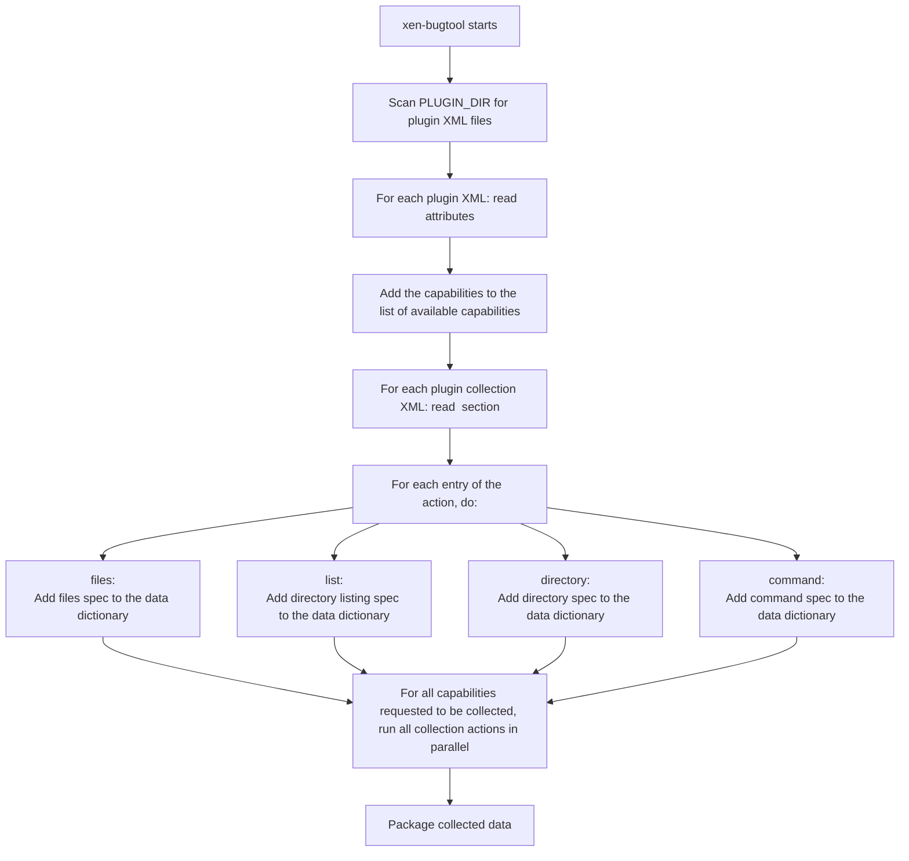

# Plugins for `xen-bugtool`: How They Work

The capabilities of `xen-bugtool` are extended by a number of plugins.

Plugins are defined using XML files that describe what data to collect
and how to collect it.

This allows for flexible, declarative extension of `xen-bugtool`'s capabilities.

## XML Structure

Plugins are loaded by the `load_plugins()` function.
It looks in `PLUGIN_DIR` (`/etc/xensource/bugtool`) for xml files.

For example, the `xapi` plugin is defined in `/etc/xensource/bugtool/xapi.xml`.

Each plugin XML file uses a `<capability>` root element with several attributes:

- **`pii`**: Indicates if the collected data may contain Personally Identifiable Information.
  - Values: `no`, `yes`, `maybe`, or `if_customized`.
- **`min_size` / `max_size`**: Minimum and maximum expected size (in bytes) of the collected data.
- **`min_time` / `max_time`**: Minimum and maximum expected time (in seconds) to collect the data.
- **`mime`**: The type of data collected.
  - Values: `data` or `text`.
- **`checked`**: Whether this plugin is enabled by default.
  - Values: `true` or `false`.
- **`hidden`**: Whether this plugin is hidden from the user interface.
  - Values: `true` or `false`.

### Example capability Definition

```xml
<capability pii="yes" max_size="16384" max_time="60" mime="text/plain" checked="true"/>
```

## Defining Data Collection

The collected data is specified in another XML file.

It is found in a subdirectory named after the plugin,
e.g., `/etc/xensource/bugtool/xapi/stuff.xml`.

### Example for a `xapi` Plugin collection definition

```xml
<collect>
<command label="sr_data_source_list">/opt/xensource/bin/xe sr-list --minimal | tr , '\n' | xargs --verbose -n 1 -I {} /opt/xensource/bin/xe sr-data-source-list uuid={} 2>&amp;1</command>
<files>/etc/stunnel/xapi.conf</files>
<list>/var/lib/corosync</list>
<list recursive="false">/etc/xen/scripts</list>
<directory pattern=".*\.log$" negate="false">/var/log/xen</directory>
</collect>
```

### `<collect>` Section

Defines what data to gather:

- **`<files>`**: Space-separated list of files to collect.
- **`<list recursive="true|false">`**:
  - List contents of specified directories. If `recursive` is `true`, subdirectories are included.
- **`<directory pattern="regex" negate="true|false">basepath</directory>`**:
  - Collect files in `basepath` matching (or not matching, if `negate="true"`) the given `regex` pattern.
- **`<command label="...">`**: Run the specified command and collect its output.
  - The `label` attribute describes the output.

### Plugin Workflow

1. **Discovery**: `xen-bugtool` scans for plugin XML files.
2. **Selection**: Plugins are enabled/disabled based on the `checked` and `hidden` attributes.
3. **Collection**: For each enabled plugin, the actions described in the `<collect>` section are performed.
4. **Packaging**: Collected data is packaged for analysis or submission.

### Flowchart of bugtool with Plugin Processing



### Best Practices

- Set `pii` accurately to avoid unintentional data exposure.
- Use `pattern` and `negate` to fine-tune file selection.
- Provide meaningful `label` values for commands.
- Test plugins to ensure they perform as expected within defined time and size limits.
